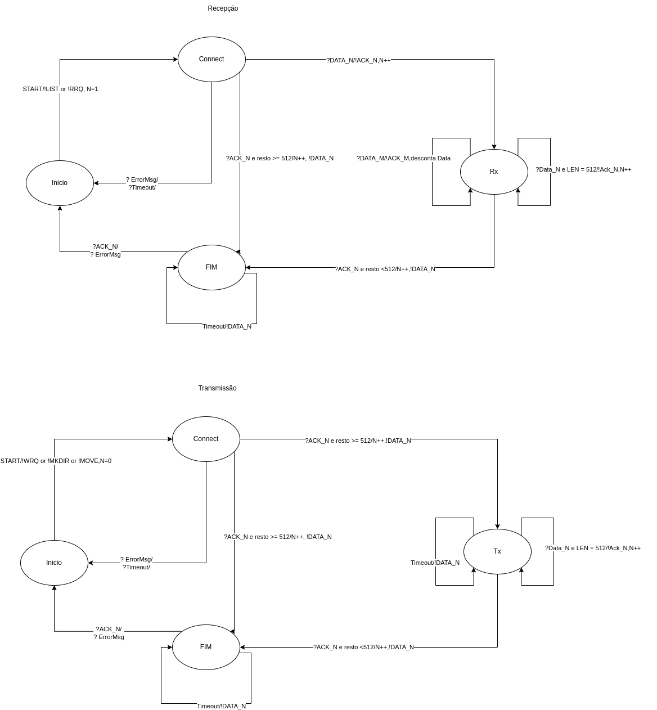
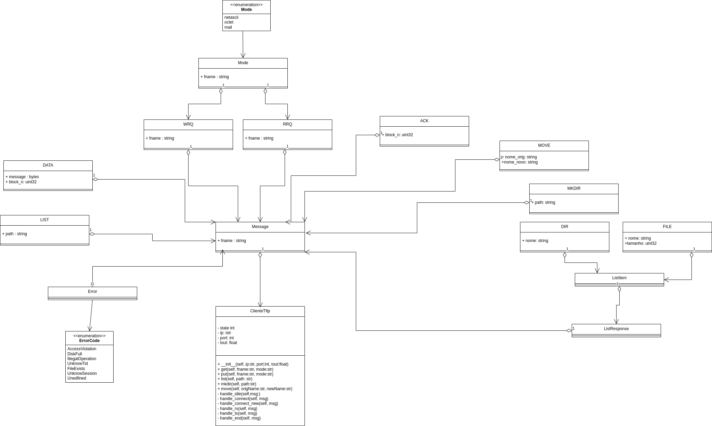

<h1 align='center'>Projeto 1 - Protocolo <a href="https://datatracker.ietf.org/doc/html/rfc1350">TFTP 2.0</a> Cliente</h1>
<p align="center">Projeto de desenvolvimento de um cliente para o protocolo TFTP</p>

Tabela de conteúdos
=================
<!--ts-->
   * [Objetivos](#Objetivos)
   * [Pré-requisitos](#Pré-requisitos)
   * [Instruções para Uso](#Instruções-para-Uso)
   * [Máquina de Estado Finita do Protocolo TFTP 2.0](#máquina-de-estado-finita-do-protocolo-tftp-20)
   * [Lógica para uso do client TFTP 2.0](#lógica-de-uso-das-requisições)
   * [Vídeo de instrução do protocolo](#video-instrução-de-uso-tftp-20)
   * [Diagrama UML](#diagrama-uml-do-protocolo-tftp-20)
   * [Autores](#Autores)
<!--te-->
# Protocolo TFTP 2.0
É um protocolo de transferência de ficheiros utilizado para transferir pequenos ficheiros entre hosts numa rede que é baseado no modelo cliente-servidor para funcionamento, usa um canal não confiável característico de utilização de envios UDP.
O protocolo envia 8 tipos de mensagens, sendo elas RRQ,WRQ,DATA,ACK,ERROR,LIST,MKDIR e MOVE todas as mensagens possuem no cabeçalho um OPCODE que é usado para identificação de associação de um pacote.

Algumas transferências começam com um pedido de leitura ou escrita de um arquivo (WRQ, RRQ) e recebem uma resposta positiva, um pacote de confirmação a ser escrito ou o primeiro pacote a ser lido. Geralmente, o pacote de confirmação inclui o número do bloco do pacote de dados de confirmação. Cada pacote está associado a um número de bloco; os números de bloco são consecutivos e começam com 1. Como a resposta positiva a uma solicitação de gravação é um pacote de confirmação, o número do bloco pode ser zero nesse caso específico. Se a resposta for um pacote de erro, a solicitação será rejeitada.
Para criar uma conexão, cada extremidade da conexão escolhe um TID para usar durante a conexão. Cada pacote possui dois TIDs associados aos endpoints da conexão, o TID de origem e o TID de destino. TID 69 decimal (105 octal) é usado para sua conexão.

As novas requisições foram feitas de acordo essas especificações,abaixo.

- LIST: fazer listagem de uma pasta. Seu formato deve ser: opcode (int 16 bits com valor 10), caminho (string)
  - Resposta de LIST: contém a listagem da pasta. Seu formato é dado por opcode (int 16 bits com valor 11) e lista de 
     Elementos. Cada Elemento é um valor de um destes dois tipos:
    - Arquivo: representa um arquivo, e é formado por: nome (string), tamanho(int 32 bits)
    - Pasta: representa uma pasta, sendo formado por: nome(string)
  - Resposta de LIST pode também ser uma mensagem Error para erro e ACK para sucesso.
- MKDIR: cria uma pasta. Seu formato deve ser: opcode (int 16 bits com valor 12), caminho (string)
  - Resposta de MKDIR: deve ser uma mensagem: 
      - 0: se sucesso, e assim enviado um ACK.
      - demais valores: um código de erro, com ErrMsg contendo uma breve descrição.
- MOVE: renomeia ou remove arquivos. Seu formato deve ser: opcode (int 16 bits com valor 13), nome_original (string), novo_nome (string) 
  - Se novo_nome for vazio, o arquivo deve ser removido
  - Resposta de MOVE: deve ser uma mensagem ACK:
    - se sucesso, e assim enviado um ACK.
    - demais valores: um código de erro, com ACK contendo uma breve descrição
# Objetivos

1. **Desenvolver uma biblioteca**: o cliente do protocolo TFTP deve ser feito na forma de uma biblioteca, de forma que possa ser reutilizado em aplicações que precisem desse protocolo.
2. **Escrever um aplicativo demonstrativo**: usando sua biblioteca, deve-se criar um aplicativo capaz de enviar ou receber arquivos,fazer listagem do contéudo de uma diretório ,criar um diretório e renomear ou remover arquivos usando o protocolo TFTP.
3. **Codificar e dodificar mensagens**: usar a tecnologia [protobuf](https://developers.google.com/protocol-buffers/) que possui um compilador para uma codificação [especifica](/client/protobuf/msg.proto) de mensagem, para o protocolo não ser depende da linguagem de programação.

# Pré-requisitos

1. Instalar as dependências necessárias para a execução do projeto:
```bash
sudo apt update

sudo apt install python3
```
2. Caso queira fazer uma especificação de nova mensagem é necessária instalar tecnologia protobuf da sua linguá desejada,neste caso python:
```bash
sudo apt-get install build-essential
wget https://github.com/google/protobuf/releases/download/v2.6.1/protobuf-2.6.1.tar.gz
tar -zxvf protobuf-2.6.1.tar.gz && cd protobuf-2.6.1/
./configure
make -j$(nproc) && make check
make install
protoc --version
echo 'export PATH=${PATH}:/usr/local/bin' >> ${HOME}/.bashrc
```
Em caso de erro tente isto:
```bash
sudo ldconfig
export LD_LIBRARY_PATH=/usr/local/lib
```

# Instruções para Uso

1. Abra um terminal e inicie a comunicação com o servidor de teste.
```bash

./tftp_server $(pwd)/server 6969

```
2. Abra um terminal e utilize alguma requisição GET, PUT, LIST , MKDIR ou MOVE.

    - GET (é necessário que o arquivo já exista no servidor para poder testar): python3 tests.py ``ip-do-servidor`` ``porta-servidor`` ``tempo-de-timeout`` ``1`` ``nome-do-arquivo``
    ```bash
    python3 tests.py 127.0.0.1 6969 10 1 teste.txt 
    ```
    - PUT (é necessário que o arquivo já exista no servidor para poder testar): python3 tests.py ``ip-do-servidor`` ``porta-servidor`` ``tempo-de-timeout`` ``2`` ``nome-do-arquivo``
    ```bash
    python3 tests.py 127.0.0.1 6969 10 2 teste.txt 
    ```
    - LIST : python3 tests.py ``ip-do-servidor`` ``porta-servidor`` ``tempo-de-timeout`` ``10`` ``caminho-do-diretório``
    ```bash
    python3 tests.py 127.0.0.1 6969 10 10 .
    ```
    - MKDIR : python3 tests.py ``ip-do-servidor`` ``porta-servidor`` ``tempo-de-timeout`` ``12`` ``caminho-do-diretório``
    ```bash
    python3 tests.py 127.0.0.1 6969 10 12 dir-teste
    ```
    - MOVE (é necessário que o arquivo já exista no servidor para poder testar): python3 tests.py ``ip-do-servidor`` ``porta-servidor`` ``tempo-de-timeout`` ``13`` ``nome-do-arquivo-original`` ``nome-do-arquivo-novo``
    ```bash
    python3 tests.py 127.0.0.1 6969 10 13 teste.txt teste_renomeado.txt
    ```

# Lógica de uso das requisições
Instânciar um objeto do tipo ``ClienteTFTP`` onde o mesmo deve ser construído por meio de passagem de parâmetros de ``ip-do-servidor, porta-servidor, tempo-de-timeout e método`` e para o manejo do cliente é possível útilizar os métodos:
- Para GET requisição de leitura
- Para PUT requisição de escrita em um arquivo 
- Para LIST requisição listagem de contéudo por um caminho no servidor. 
- Para MKDIR requisição de  escrita de um diretório por um caminho. 
- Para MOVE requisição de renomear ou excluir arquivo para.
    - Use os seguintes handlers:
        - handle : Para comunicação entre as classes poller e clientTftp por comunicação via socket para timeout.
        - handle_timeout : Para determinação do tempo para mudança do estado ocioso para outro.
        - __handle_connect_new: Para mudança de estado conectado da comunicação para as requisições LIST, MKDIR e MOVE.
        - __handle_connect: Para mudança de estado conectado da comunicação para as requisições RRQ e WRQ.
        - __handle_rx : Para mudança de estado recebimento da comunicação das requisições. 
        - __handle_tx : Para mudança de estado transmissão da comunicação das requisições. 
        - __handle_end :Para mudança de estado encerramento da comunicação.
          

# Video instrução de uso TFTP 2.0

[Link Vídeo explicando protocolo TFTP 2.0](https://www.youtube.com/watch?v=sjAN-8A0VK8)


# Máquina de Estado Finita do Protocolo TFTP 2.0

</img>

# Diagrama UML do Protocolo TFTP 2.0

<p align='center'></img></p>

# Autores

<a href="https://github.com/ArthurAnastopulos">
    <br />
    <sub><b>Arthur Anastopulos dos Santos</b></sub></a><br />

<a href="https://github.com/alanamandim">
    <br />
    <sub><b>Alana Mandim</b></sub></a><br />

<a href="https://github.com/jeffersonbcr">
    <br />
    <sub><b>Jefferson Botitano</b></sub></a>

